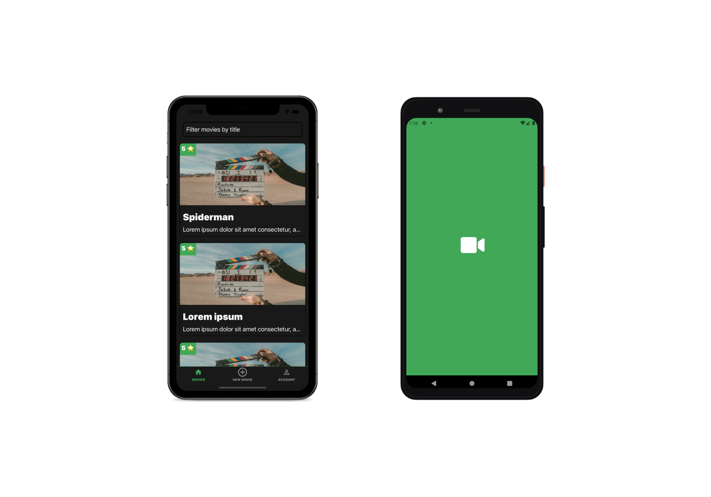

# Movie Ratings

A movie ratings mobile application made with React Native & TypeScript. Handle authentication, fetch movies
from [TMDB API](https://www.themoviedb.org), store data in locale storage.

# Overview

The easiest way to test the application is:

1. Install [Expo Go](https://expo.dev/client) on your mobile phone form Apple or Google Store.
2. Go to this [link](https://expo.dev/@yousoumar/movie-ratings) and scan the QR code.

